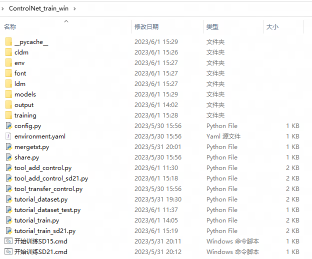

## 关于本项目
本项目是开箱即用的集成式ControlNet训练脚本。  
按照说明，你只需要准备好训练素材和基础模型就可以运行“开始训练SD15.bat”或者“开始训练SD21.bat”进行一键训练。  
大部分代码都是搬运自ControlNet原作者lllyasviel的[代码](https://github.com/lllyasviel/ControlNet)，我只是在借助搜索引擎和ChatGPT帮助下做了Pytroch 2.0的适配和流程的整合使得它更好用。  
想要了解更多的细节，可以详细阅读ControlNet原作者的“[这篇文档](https://github.com/lllyasviel/ControlNet/blob/main/docs/train.md)”和“[这篇文章](https://arxiv.org/abs/2302.05543)”。  
训练过程的各项参数和设置，可以阅读[Pytorch Lightning](https://lightning.ai/docs/pytorch/stable/api/lightning.pytorch.trainer.trainer.Trainer.html#trainer)的官方文档。  

## Windows下一键整合包
这里有一个打包好运行环境的一键整合包可以在这里下载  
 [百度网盘](https://pan.baidu.com/s/1BsB8y86-eQ1gNcFD_HNnjw?pwd=CNTS)

## 运行环境

### 硬件需求

 RTX 20系列或更高  
 12G显存或更高  

### 环境安装
nvidia GPU驱动版本号>=527.41  
Python 3.10理论上3.8~3.11都可以我没有一一测试。  
CUDA版本torch安装：'pip install torch torchvision torchaudio --index-url https://download.pytorch.org/whl/cu118'  
安装其他依赖：'pip install -r requirements.txt'  

## 如何使用
以下内容大多根据ControlNet原作者的说明修改整理，可以参考[原文](https://github.com/lllyasviel/ControlNet/blob/main/docs/train.md)  
### 第一步-设计好你的控制方式
ControlNet往往需要输入一张图片，这个图片可以看成是类似于提示词（prompt）的东西，向扩散模型说明“我想要什么”，只不过这次的“提示词”是图片。  
本文所采用例子是“往圆中填充颜色”这样一种控制方式，  
那么过程大概就是如下图这样，由提示词来说明圆内画什么颜色，背景画什么颜色“A cyan circle on a pink back ground”（粉色的背景，青色的圆）。ControlNet就是输入一个黑底上的圆形，表示圆在哪里。  
最终我们期望的出图是按照输入图片那样的位置，填充提示词指出的颜色。  

Stable Diffusion的基础模型已经有了大量的认知，比如"cyan"青色, "circle"圆, "pink"粉色, 以及"background"背景，但是ControlNet输入的图片，AI并不知道你想要它干什么，这就是训练的意义所在：让AI知道输入的图片究竟起什么作用。  

### 第二步-准备训练的环境
我这里有一个已经打包好的Windows下的环境，“ControlNet训练一键包”你可以在“[这里](https://pan.baidu.com/s/1BsB8y86-eQ1gNcFD_HNnjw?pwd=CNTS)”下载，然后解压到你想要的地方，  
当然如果你也可以clone本项目自己搭建环境。  
解压完成后，大概是这个样子：  

### 第三步-准备训练数据
这里我已经准备好了一组（400个）样例，在本项目的'readme_res\example_dataset.7z'这里  
它由三部分组成：  
提示词，一系列按照0.txt, 1.txt, 2.txt, ...的文本文件, 每个文件一行提示词  

参考图片（或者说模式图），一系列黑底白色的圆的图片，命名为0.png, 1.png, 2.png, ...  

希望的结果图片，一系列按照对应名字的提示词和参考图片产生的图片，命名为0.png, 1.png, 2.png, ...  

可以看出，同名的提示词、参考图片、结果图片是需要一一对应的。  
事实上准备训练数据时往往是先有结果图片（素材）让后使用一些工具处理成参考图片。  
将上述的训练数据按照如下结构放好：  

    ControlNet_train_win/training/dataset/prompt/X.txt
    ControlNet_train_win/training/dataset/source/X.png
    ControlNet_train_win/training/dataset/target/X.png

### 第四步-准备训练的基础模型
和其他对Stable Diffusion模型的微调类似，ControlNet的训练需要基于一个基础模型。  
如果你是基于SD1.5构架的基础模型，把你准备训练的基础模型放到'\models\'下，并命名为'basemodel_sd15.ckpt'。  
如果你是基于SD2.1构架的基础模型，把你准备训练的基础模型放到'\models\'下，并命名为'basemodel_sd21.ckpt'。  
如下图以SD1.5为例：  

如果你希望你训练的模型泛用性较好，建议使用SD1.5原版模型作为基模，如果你训练的内容和画风有较大关系，则需要使用接近画风的基础模型（比如二次元类你可以使用Anything系列）。  

### 第五步-训练
如果你的基础模型是基于SD1.5的，你可以运行如下脚本开始训练：  
'开始训练SD15.bat'  
如果你的基础模型是基于SD2.1的，你可以运行如下脚本开始训练：  
'开始训练SD21.bat'  
就是这么简单！  

正常情况下的话，训练就会自动进行了。  
如果你想对训练参数做一下自己修改的话，可以更改'config.py'中的一些参数：  

    # config.py
    save_memory = False
    batch_size = 4
    not_logger = False
    logger_freq = 300
    learning_rate = 1e-5
    max_steps = 100
    max_epochs = 10
    save_ckpt_every_n_steps = 1000
    save_top_k = -1
    save_weights_only = True
    save_last = True
    sd_locked = True
    only_mid_control = False

这里对一些参数做一下讲解：

    save_memory = False 是否开启低显存模式，16G以下可以开启  
    batch_size = 4 每步学习的的样本数一般保持默认即可  
    not_logger = False 是否关闭自动测试训练结果，False就是开启自动测试，会在每logger_freq步后测试一次模型结果  
    logger_freq = 300 上面not_logger = False才有效，表示多少步测试一次训练结果，结果保存在\image_log\train\中  
    learning_rate = 1e-5 学习率，和一般的神经网络类似的参数  
    max_steps = 100 训练多少步后停止，-1表示没有限制，一步指的是一次学习batch_size个样本  
    max_epochs = 10 训练多少轮后停止，-1表示没有限制，一轮指的是每个样本都学习过一次了  
    save_ckpt_every_n_steps = 1000 每多少步保存一次ckpt  
    save_top_k = -1 保留多少个最优结果-1表示都保存  
    save_weights_only = True 只保存权重信息，False的话会保存全部信息  
    save_last = True 在训练结束时保存  
    sd_locked = True 高阶参数，训练SD更多的层，慎改  
    only_mid_control = False 高阶参数，只训练SD的中间层（而不训练解码器）  

有几点需要注意：  
如果你的基础模型是基于SD1.5的，训练步数大概在4000-6000步左右可以获得较好的结果。  
如果你的基础模型是基于SD2.1的，训练步数大概在6000-9000步左右可以获得较好的结果。  
计算精度如果改成fp16往往会导致训练效果下降（或许增加训练的步数可以解决，这需要尝试），如果不是非常必要请不要改。计算精度这个参数不放在'config.py'里了，如果想尝试可以去'tutorial_train.py'或者'tutorial_train_sd21.py'里自己改。  
上述参数有两个决定了训练的步数，一个是'max_steps'一个是'max_epochs'以先到达的为准。  
'not_logger = False'会对性能有一些影响，如果不需要定期查看训练结果可以关闭'not_logger = True'即可。  
建议使用显存16G或更多的显卡，8G显存理论上可行，但是可能需要自行做一些优化了。  
本文的这个极小的例子400个样本batch=4也就是100步，在一张RTX 4090上大约需要5~6分钟，也就是大1000步/小时。  
事实上一次正常的训练按照5000步算的话RTX 4090上大约需要4~5小时。    

### 第六步-验证训练结果  
训练完成后的模型默认保存在'\output\'  
你可以像使用其他ControlNet模型一样把他放到webui的'\extensions\sd-webui-controlnet\models'内来测试结果。  
当然你也可以用第四步提到的logger_freq参数来实时查看训练结果。  

## 其他
1.下载“ControlNet训练一键包”的同学应该也发现了，我已经把上面的样例放进去了，而且基础模型也使用SD1.5放好了，几乎是可以一键尝试，这是为了方便初次尝试和调试环境。  
2.SD1.5训练时需要的CLIP模型openai--clip-vit-large-patch14模型（这个没有的话会自动从[huggingface.co](https://huggingface.co/openai/clip-vit-large-patch14/tree/main)下载）当然你也可以手动下载。  
3.如果你需要基于SD2.1训练，可以在“[这里](https://huggingface.co/stabilityai/stable-diffusion-2-1-base/tree/main)”下载SD2.1的原版模型'v2-1_512-ema-pruned.ckpt'，以及SD2.1所需的CLIP模型'CLIP-ViT-H-14-laion2B-s32B-b79K'在“[这里](https://huggingface.co/laion/CLIP-ViT-H-14-laion2B-s32B-b79K/tree/main)”。  
4.我没有使用xFormers，因为我自己测试下来使用了xFormers反而会导致的效率下降，当然也可能是优化问题。  
5.大部分代码都是搬运自ControlNet原作者lllyasviel的[代码](https://github.com/lllyasviel/ControlNet)，我只是在借助搜索引擎和ChatGPT帮助下做了Pytroch 2.0的适配和流程的整合使得它更好用。  
6.想要了解更多的细节，可以详细阅读ControlNet原作者的“[这篇文档](https://github.com/lllyasviel/ControlNet/blob/main/docs/train.md)”和“[这篇文章](https://arxiv.org/abs/2302.05543)”。  
7.训练过程的各项参数和设置，可以阅读[Pytorch Lightning](https://lightning.ai/docs/pytorch/stable/api/lightning.pytorch.trainer.trainer.Trainer.html#trainer)的官方文档。  

## 致谢
再次感谢lllyasviel令人惊叹的工作- [ControlNet](https://github.com/lllyasviel/ControlNet)  
特别感谢Mikubill的插件- [Mikubill' A1111 Webui Plugin](https://github.com/Mikubill/sd-webui-controlnet)
