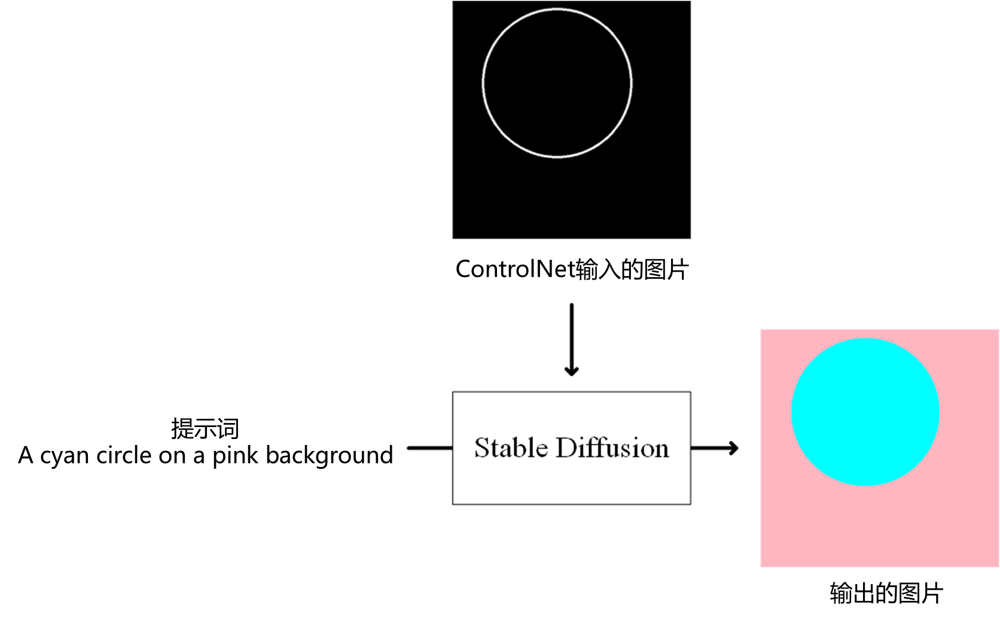
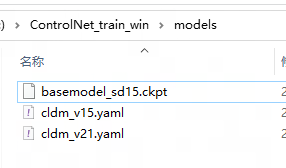

### Language
[中文](README.cn.md)   

## The following content is translated by ChatGPT and may contain errors or misunderstandings. Thank you for your understanding.

## About this project
This project is an out-of-the-box integrated ControlNet training script.   
Following the instructions, you only need to prepare the training materials and the base model to run "Start Training SD15.bat" or "Start Training SD21.bat" for one-click training.   
Most of the code is adapted from the code of the original author lllyasviel's [ControlNet](https://github.com/lllyasviel/ControlNet), and I just adapted and integrated the process with Pytorch 2.0 for better usability with the help of search engines and ChatGPT.  
For more details, you can read the original author's "[this document](https://github.com/lllyasviel/ControlNet/blob/main/docs/train.md)" and "[this article](https://arxiv.org/abs/2302.05543)".  
For the various parameters and settings of the training process, you can read the official documentation of [Pytorch Lightning](https://lightning.ai/docs/pytorch/stable/api/lightning.pytorch.trainer.trainer.Trainer.html#trainer).  

## One-Click Integration Package for Windows
Here is a one-click integration package with a packaged running environment that can be downloaded from [Baidu Netdisk](https://pan.baidu.com/s/1BsB8y86-eQ1gNcFD_HNnjw?pwd=CNTS).

## Running Environment

### Hardware Requirements

RTX 20 series or higher  
12G VRAM or higher

### Environment Installation
nvidia GPU driver version >=527.41  
Python 3.10, theoretically 3.8~3.11 should all work, but I have not tested them one by one.  
CUDA version torch installation: 'pip install torch torchvision torchaudio --index-url https://download.pytorch.org/whl/cu118'  
Install other dependencies: 'pip install -r requirements.txt'  

## How to Use
Most of the following content is modified and organized according to the instructions of the original author of ControlNet, and can refer to [the original text](https://github.com/lllyasviel/ControlNet/blob/main/docs/train.md).  

### Step One - Design your control method
ControlNet often requires an input image, which can be seen as a kind of prompt, telling the diffusion model "what I want", but this time the "prompt" is an image.  
The example used in this article is a control method of "filling colors into a circle". So the process is roughly like the following diagram, with the prompt indicating what color to draw inside the circle and what color to draw in the background "A cyan circle on a pink back ground" (pink background, cyan circle). ControlNet inputs a circle on a black background, indicating where the circle is.  
In the end, we expect the generated image to fill in the colors indicated by the prompt, in the same position as the input image.  

The basic model of Stable Diffusion already has a lot of cognition, such as "cyan" for cyan color, "circle" for circle, "pink" for pink, and "background" for background, but the AI does not know what you want it to do with the input image, which is the significance of training: to let the AI know what role the input image plays.  

### Step 2 - Prepare the Training Environment
I have already packaged a Windows environment, "ControlNet Training One-Click Package", which you can download from [here](https://pan.baidu.com/s/1BsB8y86-eQ1gNcFD_HNnjw?pwd=CNTS) and extract it to the desired location. Of course, you can also clone this project and build the environment yourself. After extracting, it should look like this:  

### Step 3 - Prepare the Training Data
I have prepared a set of 400 examples in this project's 'readme_res\example_dataset.7z' file. It consists of three parts:  
- Prompts: a series of text files named 0.txt, 1.txt, 2.txt, ..., each containing one prompt per line.  

- Reference Images: a series of black and white circular images named 0.png, 1.png, 2.png, ...  

- Desired Result Images: a series of images generated from prompts and reference images with the corresponding names, named 0.png, 1.png, 2.png, ...  

As can be seen, prompts, reference images, and desired result images with the same names need to correspond one-to-one. In fact, when preparing the training data, the desired result images (materials) are usually prepared first and then processed into reference images using some tools. Put the training data in the following structure:  

    ControlNet_train_win/training/dataset/prompt/X.txt
    ControlNet_train_win/training/dataset/source/X.png
    ControlNet_train_win/training/dataset/target/X.png

### Step 4 - Prepare the Basic Training Model
Similar to fine-tuning Stable Diffusion model, training ControlNet requires a basic model. If you have a basic model based on the SD1.5 architecture, put it under '\models\' and name it 'basemodel_sd15.ckpt'. If you have a basic model based on the SD2.1 architecture, put it under '\models\' and name it 'basemodel_sd21.ckpt'. Take SD1.5 as an example:  
  
If you want your trained model to have better generalization, it is recommended to use the original SD1.5 model as the basis. If your training content and style are closely related, you need to use a basic model that is closer to the style (for example, for anime-style content, you can use the Anything series).   

### Step 5 - Training
If your base model is based on SD1.5, you can run the following script to start training:  
'Start Training SD15.bat'  
If your base model is based on SD2.1, you can run the following script to start training:  
'Start Training SD21.bat'  
It's that simple!  

Normally, training will proceed automatically. If you want to make some modifications to the training parameters, you can change some parameters in 'config.py'.  

    save_memory = False //Enable low VRAM mode, which can be turned on for devices with less than 16GB of VRAM.  
    batch_size = 4 The //number of samples learned per step.  
    not_logger = False //Disable automatic testing of training results. Setting it to False means enabling automatic testing, which will test the model after each logger_freq steps.  
    logger_freq = 300 //The parameter not_logger = False needs to be set in order for this to be effective. It indicates how often to test the training results, and the results will be saved in "\image_log\train\".  
    learning_rate = 1e-5 //Learning rate, which is a parameter similar to other neural networks.  
    max_steps = 100 //The number of steps to stop training. A value of -1 means there is no limit. One step refers to learning batch_size samples once.  
    max_epochs = 10 //The number of epochs to stop training. A value of -1 means there is no limit. One epoch refers to each sample being learned once.  
    save_ckpt_every_n_steps = 1000 //Save the checkpoint every x steps.  
    save_top_k = -1 //Keep x number of the best results. A value of -1 means to save all.  
    save_weights_only = True //Save only the weight information. If set to False, all information will be saved.  
    save_last = True //Save at the end of training.  
    sd_locked = True //Advanced parameters for training deeper layers in SD models. Be cautious when modifying these parameters.  
    only_mid_control = False //Advanced parameters to only train the middle layer of the SD model (without training the decoder).  

There are a few points to note:  
- If your base model is based on SD1.5, the results converged after training for approximately 4000~6000 steps..  
- If your base model is based on SD2.1, the results converged after training for approximately 6000~9000 steps..  
- Changing the calculation precision to fp16 often leads to a decrease in training performance (perhaps increasing the number of training steps can solve this, but this requires experimentation). If it is not necessary, please do not change the calculation precision. This parameter is not included in 'config.py'. If you want to try, you can change it in 'tutorial_train.py' or 'tutorial_train_sd21.py'.  
- There are two parameters that determine the number of training steps: 'max_steps' and 'max_epochs', and the earlier one is used.  
- 'not_logger = False' will have some impact on performance. If you don't need to check the training results regularly, you can turn it off by setting 'not_logger = True'.  
- It is recommended to use a graphics card with 16GB or more of memory. 8GB memory is theoretically feasible, but you may need to do some optimization yourself.  
- In this minimal example with 400 samples and a batch of 4, it takes about 5-6 minutes on an RTX 4090, which is about 1000 steps/hour.  
- In fact, a normal training session takes about 4-5 hours on an RTX 4090 with 5000 steps.  
- The training samples of ControlNet official model are typically in the range of hundreds of thousands to millions, and the typical training time is around 200 A100 hours.

### Step 6 - Validate Training Results
After the training is completed, the model is saved by default in '\output\'.  
You can test the results by placing the model in '\extensions\sd-webui-controlnet\models' in the web UI, just like with other ControlNet models.  
Of course, you can also use the 'logger_freq' parameter mentioned in Step 5 to view the training results in real-time.  
 
## Others
1. People who have downloaded the "ControlNet Training Toolkit" may have noticed that I have included the sample code and pre-installed the SD1.5 base model. This makes it almost a one-click experience and is designed to make it easier for first-time users to try it out and debug the environment.  
2. The CLIP model 'openai--clip-vit-large-patch14' is required for training with SD1.5. If this model is missing, it will automatically be downloaded from [huggingface.co](https://huggingface.co/openai/clip-vit-large-patch14/tree/main).Of course, you can also download it manually.  
3. If you need to train using SD2.1, you can download the original SD2.1 model 'v2-1_512-ema-pruned.ckpt' from [here](https://huggingface.co/stabilityai/stable-diffusion-2-1-base/tree/main), as well as the required CLIP model 'CLIP-ViT-H-14-laion2B-s32B-b79K' for SD2.1 from [here](https://huggingface.co/laion/CLIP-ViT-H-14-laion2B-s32B-b79K/tree/main).  
4. I did not use xFormers because in my own testing, using xFormers actually resulted in decreased efficiency. However, this may be due to optimization issues.  
5. Most of the code is adapted from the code of the original author lllyasviel's [ControlNet](https://github.com/lllyasviel/ControlNet), and I just adapted and integrated the process with Pytorch 2.0 for better usability with the help of search engines and ChatGPT.  
6. For more details, you can read the original author's "[this document](https://github.com/lllyasviel/ControlNet/blob/main/docs/train.md)" and "[this article](https://arxiv.org/abs/2302.05543)".  
7. For the various parameters and settings of the training process, you can read the official documentation of [Pytorch Lightning](https://lightning.ai/docs/pytorch/stable/api/lightning.pytorch.trainer.trainer.Trainer.html#trainer).  

## Acknowledgments
Once again, a big thank you to lllyasviel for the amazing work on [ControlNet](https://github.com/lllyasviel/ControlNet).  
And a special thanks to Mikubill for the [Mikubill's A1111 Webui Plugin](https://github.com/Mikubill/sd-webui-controlnet).
